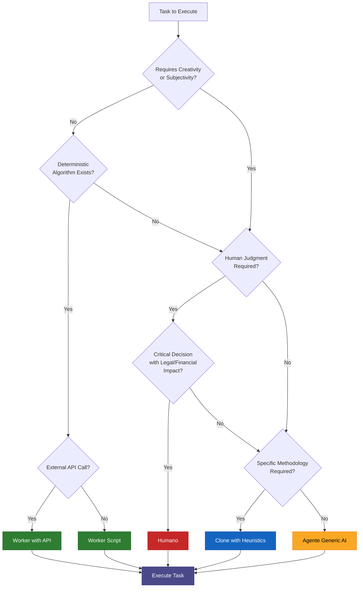

<div align="center">

# 🐒 Fuja do Mico

**Newsletter financeira gerada por IA — do dado bruto ao inbox, sem servidor próprio.**

[](https://python.org)
[](https://github.com/features/actions)
[](https://anthropic.com)
[](https://supabase.com)
[](https://vercel.com)

*Conteúdo educativo — não é recomendação de investimento.*

</div>

---

## O que é

O **Fuja do Mico** é um pipeline de newsletter financeira totalmente automatizado que roda dentro do GitHub. Nenhum servidor próprio. Nenhuma plataforma visual paga. A edição semanal é gerada, revisada por humano e distribuída sem nenhuma intervenção manual além de um clique de aprovação.

A arquitetura opera em duas camadas:

- **Camada de Escuta Contínua** — 6 nodes assíncronos coletam e classificam conteúdo 24/7, alimentando um pool central no Supabase
- **Pipeline de Geração** — toda segunda-feira o pipeline consome o pool, passa por agentes ReAct com clones de investidores e gera a edição completa

---

## Arquitetura

```
┌─────────────────────────────────────────────────────────┐
│              CAMADA DE ESCUTA CONTÍNUA                  │
│                                                         │
│  📰 RSS          → ┐                                    │
│  📧 Gmail        → ┤                                    │
│  📺 YouTube      → ┼──→  conteudo_raw  ←──→  Triagem   │
│  📸 Instagram    → ┤     (Supabase)         (Haiku)     │
│  🐦 Twitter/X    → ┤                                    │
│  🔍 Deep Research→ ┘                                    │
└─────────────────────────────────────────────────────────┘
                          ↓  pool ≥ 10 itens aprovados
┌─────────────────────────────────────────────────────────┐
│              PIPELINE DE GERAÇÃO (segunda 8h BRT)       │
│                                                         │
│  Pool →  Gate Editorial → Agentes de Linha → Geração   │
│          (ALTO/MEDIO)     Graham · Buffett    Claude     │
│                           Lynch · Barsi      Sonnet     │
│                           Damodaran                     │
│                                ↓                        │
│  Template HTML → Notificação Telegram → Aprovação →    │
│                                         Brevo           │
└─────────────────────────────────────────────────────────┘
```

---

## Nodes de Coleta

| Node | Frequência | Fonte | Destaques |
|------|-----------|-------|-----------|
| **RSS** | A cada hora | Feeds financeiros configuráveis | Grava em `conteudo_raw` com delta incremental |
| **Gmail** | A cada hora (offset 30min) | Newsletters recebidas | Lê diretamente da caixa de entrada |
| **YouTube** | A cada hora | 5 canais concorrentes | Playlist API (1 quota/req), detecta Shorts |
| **Instagram** | A cada 6h | 6 perfis configurados | Carrosséis extraídos slide a slide via Claude Vision |
| **Twitter/X** | A cada 6h | 3 handles financeiros | Coleta via Apify com delta por conta |
| **Deep Research** | Domingo 6h UTC | Web (EXA) | ReActAgent com 5 iterações, entrega antes do pipeline |

---

## Pipeline de Geração

```
conteudo_raw (Supabase)
    ↓  ≥ 10 itens aprovados
Gate Editorial
    ↓  ALTO / MEDIO / BAIXO
Agentes de Linha (ReActAgent + Claude Sonnet)
    ├── Graham    → value investing, P/L, P/VP, dívida
    ├── Buffett   → moat, ROE, margens, EBITDA
    ├── Lynch     → PEG Ratio, crescimento
    ├── Damodaran → DCF, WACC, valuation
    └── Barsi     → dividendos, DY > 6%, proventos
    ↓
Geração da edição completa
    ↓
Template HTML (visual sections-based)
    ↓
Notificação Telegram + Dashboard
    ↓  aprovação humana
Distribuição via Brevo
```

---

## Filosofia — A Task como Unidade Atômica

> *"Não existe nada além da task. Task é a unidade atômica. O que você muda é o executor."*

A arquitetura deste projeto parte de um princípio simples que inverte a lógica convencional de agentes de IA.

A abordagem tradicional parte do agente: você cria um agente, define seu system prompt, conecta ferramentas e tenta fazer ele executar tarefas. Aqui a lógica é invertida. **Todo trabalho é sempre a execução de uma task.** O que muda é quem (ou o quê) a executa:

| Executor | Quando usar |
|----------|-------------|
| **Humano** | Decisões com impacto jurídico, financeiro ou estratégico crítico — onde alguém precisa ser responsabilizado |
| **Clone** | Existe uma metodologia ou heurística consolidada (ex: "como Buffett analisa P/L") |
| **Agente IA genérico** | Requer criatividade e subjetividade, mas sem metodologia definida |
| **Worker com API** | Determinístico + precisa de serviço externo (ex: buscar cotação na B3) |
| **Worker Script** | Determinístico + tudo local (ex: parsear um feed RSS) |

Uma task validada é lei: ela tem descrição clara, input definido, output esperado, pré-condições, critérios de aceitação e executor designado. Só após validada vai para execução. **Mais de 80% das tarefas do dia a dia são determinísticas** — elas não precisam de um LLM sofisticado, precisam de um worker confiável.

O Fuja do Mico aplica exatamente isso: coleta de RSS, parsing de feeds e gravação no banco são workers (Python scripts). Triagem editorial e geração de texto são clones com heurísticas dos investidores. A aprovação final da edição permanece humana — é uma decisão com impacto sobre os leitores.

### Árvore de Decisão do Executor



No pipeline do Fuja do Mico: os nodes de coleta (RSS, Gmail, YouTube, Instagram, Twitter) são **Workers with API**. A triagem automática e os clones de investidores são **Clones with Heuristics**. A aprovação da edição antes do envio é **Humano** — propositalmente.

---

## Stack

| Componente | Tecnologia |
|-----------|-----------|
| Orquestrador | GitHub Actions |
| IA principal | Claude Sonnet 4.6 (geração) + Haiku 4.5 (triagem) |
| IA visual | Claude Vision (carrosséis Instagram) |
| Busca web | EXA API |
| Coleta social | Apify (Instagram · Twitter) |
| Banco de dados | Supabase (PostgreSQL) |
| Dashboard | Next.js + Vercel |
| Dados B3 | Brapi · Fintz |
| Distribuição | Brevo |
| Notificação | Telegram Bot |
| Linguagem | Python 3.11 |

---

## Estrutura do Repositório

```
fuja-do-mico-gh/
├── .github/workflows/
│   ├── newsletter.yml          ← Pipeline principal (segunda 8h BRT)
│   ├── rss_poll.yml            ← Node RSS (horário)
│   ├── gmail_poll.yml          ← Node Gmail (horário, offset 30min)
│   ├── social_poll.yml         ← Node YouTube/Instagram/Twitter
│   ├── triage_pool.yml         ← Triagem automática (a cada 2h)
│   └── research.yml            ← Deep Research (domingo 6h UTC)
│
├── scripts/
│   ├── 00_orchestrator.py      ← Orquestrador do pipeline principal
│   ├── 01_collect_gmail.py     ← Coleta Gmail
│   ├── 02_collect_rss.py       ← Coleta RSS
│   ├── 03_collect_youtube.py   ← Coleta YouTube (pipeline principal)
│   ├── 04_collect_brapi.py     ← Dados B3 via Brapi
│   ├── 04b_collect_fintz.py    ← Dados B3 via Fintz (DY, proventos)
│   ├── 05_triage.py            ← Gate de triagem (Haiku)
│   ├── 06_generate.py          ← Geração da edição (Sonnet)
│   ├── 07_populate_template.py ← Renderização HTML
│   ├── 08_notify.py            ← Notificação Telegram
│   ├── 09_distribute.py        ← Distribuição Brevo
│   ├── 12_triage_pool.py       ← Triagem assíncrona do pool
│   ├── db_provider.py          ← Provider Supabase central
│   ├── nodes/
│   │   ├── concorrentes/
│   │   │   ├── youtube_collector.py    ← Node YouTube contínuo
│   │   │   ├── instagram_collector.py  ← Node Instagram + Vision
│   │   │   ├── twitter_collector.py    ← Node Twitter/X
│   │   │   └── processors/
│   │   │       ├── carousel_vision.py  ← Extração de slides (Claude Vision)
│   │   │       └── video_transcriber.py← Transcrição YouTube
│   │   └── noticias/
│   │       └── deep_research_agent.py  ← Deep Research (ReActAgent + EXA)
│   └── react/
│       ├── agent.py                    ← ReActAgent base
│       ├── criteria.py                 ← Critérios de parada
│       ├── tools.py                    ← Interface Tool
│       └── belt/                       ← Tools: EXA, Brapi, Fintz, ...
│
├── prompts/clones/finance-investments/
│   ├── warren-buffett.md
│   ├── benjamin-graham.md
│   ├── peter-lynch.md
│   ├── aswath-damodaran.md
│   └── luiz-barsi.md
│
├── config/
│   ├── concorrentes.json       ← Contas Instagram, Twitter e canais YouTube
│   ├── deep_research_queries.json ← Queries semanais (editável sem código)
│   └── rss_feeds.txt           ← URLs dos feeds monitorados
│
├── supabase/migrations/        ← DDL + RLS do schema
├── templates/newsletter.html   ← Template visual da newsletter
├── dashboard/                  ← Next.js (Kanban + Realtime + Chat IA)
└── requirements.txt
```

---

## Setup

### 1. Repositório e Environment de Aprovação

```bash
# Clone e suba para o seu GitHub privado
git clone https://github.com/leonardomensitieri/fuja-do-mico
```

No GitHub: **Settings → Environments → New environment**
- Nome: `aprovacao-humana`
- Required reviewers: seu usuário GitHub

### 2. Banco de Dados (Supabase)

Crie um projeto em [supabase.com](https://supabase.com) e aplique as migrations:

```sql
-- No SQL Editor do Supabase:
-- 1. supabase/migrations/20260228000000_fix_fonte_constraint.sql
-- 2. supabase/migrations/20260228010000_create_conteudo_raw.sql
```

### 3. Secrets do GitHub

**Settings → Secrets and variables → Actions**

| Secret | Obrigatório | Descrição |
|--------|-------------|-----------|
| `ANTHROPIC_API_KEY` | ✅ | Anthropic (Claude Sonnet + Haiku + Vision) |
| `SUPABASE_URL` | ✅ | URL do projeto Supabase |
| `SUPABASE_SERVICE_KEY` | ✅ | Chave de serviço Supabase |
| `BREVO_API_KEY` | ✅ | Distribuição de emails |
| `BREVO_LIST_ID` | ✅ | ID da lista de contatos |
| `EMAIL_REMETENTE` | ✅ | Email remetente configurado no Brevo |
| `TELEGRAM_BOT_TOKEN` | ✅ | Bot de notificação e aprovação |
| `TELEGRAM_CHAT_ID` | ✅ | Chat ID do revisor |
| `BRAPI_TOKEN` | ✅ | Dados financeiros B3 |
| `APIFY_API_TOKEN` | ✅ | Coleta Instagram e Twitter/X |
| `EXA_API_KEY` | ✅ | Deep Research semanal |
| `YOUTUBE_API_KEY` | ⚡ | Canais concorrentes YouTube |
| `FINTZ_API_KEY` | ⚡ | DY, proventos, Tesouro Direto |
| `GMAIL_CREDENTIALS_JSON` | ⚡ | Coleta de newsletters via Gmail |
| `GMAIL_TOKEN_JSON` | ⚡ | Token OAuth Gmail |

### 4. Dashboard (opcional)

```bash
cd dashboard
npm install
# Configure .env.local com SUPABASE_URL, SUPABASE_ANON_KEY, ANTHROPIC_API_KEY
npm run dev
```

Deploy no Vercel com um clique após configurar as env vars.

### 5. Ativar os Workflows

Em **Actions** no GitHub, ative os workflows:
- `newsletter.yml` — pipeline principal
- `rss_poll.yml`, `gmail_poll.yml`, `social_poll.yml` — coleta contínua
- `triage_pool.yml` — triagem automática
- `research.yml` — deep research semanal

Para testar antes do cron: clique em **"Run workflow"** em qualquer um.

---

## Variáveis de Configuração

| Variável | Tipo | Default | Descrição |
|----------|------|---------|-----------|
| `POOL_THRESHOLD` | GitHub Variable | `10` | Mínimo de itens aprovados para usar pool |
| `TICKERS` | Secret | — | Ex: `PETR4,VALE3,ITUB4,BBDC4` |
| `SUPABASE_SALVAR_CONTEUDO` | Variable | `false` | Persistir dados brutos no Supabase |

---

## Custo Operacional Estimado

| Serviço | Frequência | Custo estimado |
|---------|-----------|----------------|
| GitHub Actions | — | Gratuito (plano free) |
| Claude Sonnet (geração) | Por edição | ~$0.10 |
| Claude Haiku (triagem pool) | Por batch de 20 | ~$0.001 |
| Claude Vision (carrosséis) | Por carrossel | ~$0.015 |
| EXA API (deep research) | Por Sunday | ~$0.03 |
| Apify — Instagram (6 contas, 6h) | /mês | ~$8–15 |
| Apify — Twitter (3 handles, 6h) | /mês | ~$3–8 |
| Brapi + YouTube API | — | Gratuito |
| Fintz | — | ~$0/mês (plano gratuito) |
| Supabase | — | Gratuito (plano free) |
| Brevo | Até 300 emails/dia | Gratuito |
| Vercel (dashboard) | — | Gratuito |
| **Total estimado** | **/mês** | **~$15–30/mês** |

---

## Contas e Queries Configuráveis

Edite `config/concorrentes.json` para ajustar quais contas monitorar:

```json
{
  "youtube": [
    { "handle": "@primorico", "ultima_verificacao": null }
  ],
  "instagram": ["thiago.nigro", "bruno_perini"],
  "twitter": ["thiago_nigro", "BrunoPerini"]
}
```

Edite `config/deep_research_queries.json` para ajustar as pesquisas semanais:

```json
{
  "queries": [
    "SELIC decisão Banco Central",
    "Resultados trimestrais empresas B3"
  ]
}
```

---

<div align="center">

*Fuja do Mico — Liga Acadêmica de Investimentos · Conteúdo educativo, não recomendação de investimento.*

</div>
